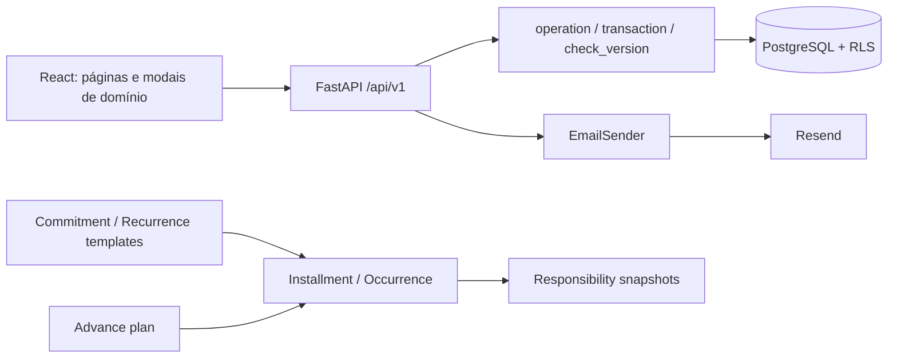
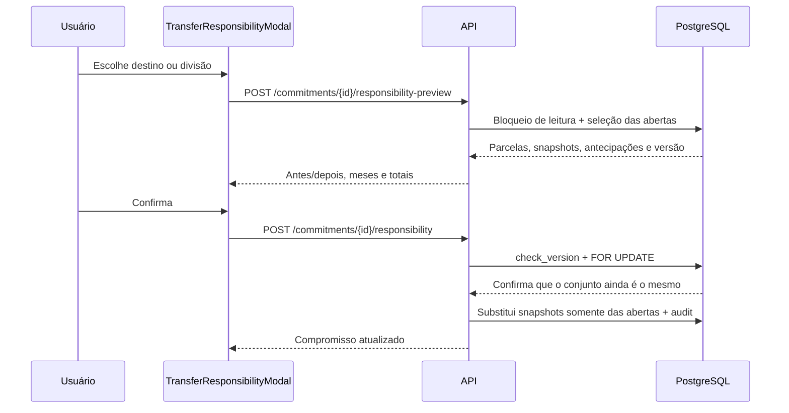

# Gestão familiar, edição, perfil, recuperação e cartões — Design

**Spec:** `.specs/features/gestao-e-experiencia-v2/spec.md`  
**Contexto:** `.specs/features/gestao-e-experiencia-v2/context.md`  
**Status:** Aprovado pelo usuário em 2026-09-12  
**Abordagem arquitetural:** A — snapshots explícitos por obrigação, aprovada em 2026-09-12

---

## Resumo da solução

A evolução será construída sobre a arquitetura atual React/FastAPI/PostgreSQL, sem trocar autenticação, banco ou mecanismo transacional. A responsabilidade financeira deixa de ser lida diretamente do compromisso e passa a ser fotografada em cada parcela e ocorrência recorrente. O compromisso e a regra recorrente continuam guardando apenas o modelo usado para gerar obrigações futuras.

O frontend ganha um primitive único de modal baseado em `<dialog>` e componentes de domínio menores. Gestão familiar, perfil e convites passam a ter rotas próprias; autenticação é dividida entre “usuário autenticado” e “usuário autenticado com família”, permitindo aceitar um convite antes de possuir uma associação. A recuperação de senha usa um adaptador de email com Resend, token bruto apenas em memória e hash no PostgreSQL. Cartões recebem campos estruturados e um catálogo visual versionado no frontend.



## Restrições e invariantes

- Sessões continuam opacas em cookie HttpOnly/Secure, conforme AD-005.
- Toda leitura ou escrita familiar permanece isolada por `family_id`; novas tabelas familiares recebem RLS.
- `operation()`/`mutate()` continuam sendo a fronteira de idempotência das mutações familiares.
- Uma obrigação paga nunca tem seus snapshots de responsabilidade regravados.
- Um convite ou token de senha é consumido uma única vez por atualização bloqueada no PostgreSQL.
- Token bruto não é persistido nem escrito em logs.
- Número completo, validade e CVV de cartão nunca entram em DTO, banco, log ou DOM.
- `PUBLIC_APP_URL` gera links externos; `APP_ORIGIN` continua protegendo CORS/CSRF.

## Pesquisa aplicada

- A API do Resend aceita `Idempotency-Key` em `POST /emails` e mantém a deduplicação por 24 horas. O envio usará `password-reset/{reset_id}` como chave estável por tentativa.
- A Web Share API permite compartilhar texto e URL com um alvo escolhido pelo usuário. O frontend tenta `navigator.share()` quando disponível e oferece WhatsApp/cópia como fallbacks explícitos.
- As fontes oficiais consultadas mostram que identidades como Nubank e Itaú evoluem como sistemas, não como uma única cor fixa. Por isso o catálogo terá tokens próprios versionados e não copiará a arte de um cartão físico.
- Fontes: [Resend — Idempotency Keys](https://resend.com/docs/dashboard/emails/idempotency-keys), [MDN — Web Share API](https://developer.mozilla.org/en-US/docs/Web/API/Web_Share_API), [Nubank — Brand Refresh](https://blog.nubank.com.br/brand-refresh-como-renovamos-a-identidade-visual-do-nubank/) e [Itaú — Feito de futuro](https://www.itau.com.br/feito-de-futuro), consultados em 2026-09-12.

## Fluxos principais

### Transferência de responsabilidade



O escopo padrão é “todas as parcelas abertas”. A prévia devolve também antecipações planejadas ligadas a essas parcelas. Como `advance_items` já aponta para `installments`, o plano passa a refletir o novo snapshot sem duplicação. Antecipações pagas deixam a parcela paga e, portanto, protegida.

A divisão avançada é informada como valores agregados que somam o total aberto. O domínio distribui esses valores numa matriz determinística: cada linha soma o valor-base da parcela e cada coluna soma o valor agregado da pessoa. Isso evita erros de centavos ao dividir várias parcelas pequenas. Dentro de cada parcela, os valores são guardados como pesos proporcionais; se uma antecipação aplicar desconto, `allocate()` preserva a proporção.

### Edição completa do compromisso

1. `EditCommitmentModal` carrega detalhes e permissões de campo.
2. `POST /commitments/{id}/edit-preview` valida o payload e mostra cronograma anterior/novo, ciclos reabertos e planos afetados.
3. Sem pagamentos, a confirmação atualiza o compromisso e reconstrói as parcelas/snapshots em uma única transação. Antecipações apenas planejadas são canceladas e restauradas antes da reconstrução, com aviso explícito na prévia.
4. Com qualquer pagamento, somente descrição e categoria podem ser alteradas nessa edição; responsabilidade usa o fluxo próprio e atinge apenas abertas.
5. Ciclos confirmados mas não pagos que forem afetados são reabertos (`confirmed=false`) e aparecem na prévia.
6. A confirmação usa `version`; qualquer diferença rejeita tudo com `version_conflict`.

### Convite familiar

O token tem formato opaco `family_id.secret`. O UUID apenas permite configurar o contexto RLS antes da consulta; a autorização depende do segredo aleatório cujo hash está no banco. O frontend lê o token da URL, remove-o imediatamente com `history.replaceState`, guarda-o apenas em memória e consulta o backend por POST.

- Conta existente sem família: login cria sessão; a página usa a dependência de usuário autenticado sem exigir `Membership` e consome o convite.
- Conta nova: cadastro e consumo acontecem na mesma transação; depois a sessão é emitida.
- Conta que já pertence à família: resposta idempotente “você já participa”.
- Conta que pertence a outra família: rejeição clara enquanto múltiplas famílias estiverem fora de escopo.
- Duas aceitações concorrentes bloqueiam a linha do convite; apenas a primeira define `used_at/used_by`.

### Recuperação de senha

1. `POST /auth/password-reset/request` normaliza o email, aplica limites por HMAC do email e da origem e sempre responde `202` com a mesma mensagem.
2. Para usuário ativo, cria token aleatório, persiste somente SHA-256 do token e agenda envio após o commit. O token bruto existe apenas na memória da tarefa de envio.
3. O `EmailSender` envia com timeout curto e chave idempotente. Uma tarefa atualiza `delivery_status` para `sent` ou `failed`; falha gera apenas `operation_id` no log.
4. Se o processo morrer antes do envio, o token pendente expira e a pessoa pode solicitar outro; nenhuma credencial recuperável fica em fila persistida.
5. A página `/redefinir-senha` lê o token, remove query/hash do histórico antes de renderizar links e usa `Referrer-Policy: no-referrer`.
6. `POST /auth/password-reset/complete` bloqueia o token, valida expiração/uso/senha, atualiza Argon2 e revoga sessões e todos os resets do usuário na mesma transação.

## Reuso do código existente

| Componente/padrão | Local | Uso no Design |
| --- | --- | --- |
| Unidade transacional e idempotência | `backend/app/db/unit_of_work.py` | Reusar `transaction`, `mutate` e `check_version`; extrair variante global somente para autenticação pré-família |
| Autorização familiar e serialização | `backend/app/api/common.py` | Reusar `member`, `get_row`, `reopen_month`; adicionar `require_owner` e serializers explícitos |
| Cálculo monetário | `backend/app/domain/money.py` | Reusar `allocate`; adicionar distribuição matricial para divisão agregada |
| Prévia/persistência de compra | `backend/app/api/commitments.py` | Extrair serviço de cronograma usado em criação e edição |
| Snapshots de antecipação | `backend/app/api/advances.py` | Restaurar/cancelar planos antes de reconstruir parcelas; manter referência a `Installment` |
| Sessão e Argon2 | `backend/app/api/auth.py` | Extrair emissão/validação de sessão e política de senha compartilhada |
| Cliente idempotente | `frontend/src/api/client.ts` | Manter `createOperation`; enriquecer `ApiError` com `code`, `fields`, `operation_id` e diferença |
| Formulário de compromisso | `frontend/src/components/CommitmentForm.tsx` | Reusar campos, conversão em centavos e visualização do cronograma no editor |
| Caddy SPA fallback | `deploy/Caddyfile` | Já resolve links diretos de convite e recuperação para `index.html` |

## Modelo de dados

### Alterações em tabelas existentes

| Tabela | Campos/alterações | Regras |
| --- | --- | --- |
| `families` | `code varchar(12)`, `version int`, `created_at timestamptz` | Código aleatório em alfabeto sem caracteres ambíguos, único e rotacionável |
| `users` | `version int`, `created_at timestamptz` | Email continua único e somente leitura nesta feature |
| `memberships` | `role varchar(10)`, `created_at timestamptz` | `role in ('owner','member')`; índice parcial único impede dois owners na mesma família |
| `cards` | `institution_key varchar(40)`, `institution_name varchar(100)`, `network varchar(30)`, `last_four varchar(4)` | Instituição catalogada usa chave estável; custom usa `other` + nome; últimos quatro só dígitos |

`responsibility_shares` continua existindo como template do compromisso para novas parcelas e compatibilidade de edição completa. `recurring_rules.shares` continua sendo o template de ocorrências futuras. Leituras mensais deixam de usar ambos diretamente.

### `installment_responsibility_shares`

| Campo | Tipo | Observação |
| --- | --- | --- |
| `id` | UUID textual | Padrão atual |
| `family_id` | FK | RLS e FK composta |
| `installment_id` | FK composta | Obrigação fotografada |
| `user_id` | FK composta de membership | Responsável histórico |
| `weight` | bigint | Peso positivo usado por `allocate()` |
| `position` | int | Ordem estável de apresentação |
| `created_at` | timestamptz | Auditoria técnica |

Restrições: único `(installment_id, user_id)`, `weight > 0`, índices por `family_id`, `installment_id` e `user_id`.

### `occurrence_responsibility_shares`

Mesma estrutura da tabela anterior, substituindo `installment_id` por `occurrence_id`. O snapshot nasce em `materialize()` e nunca muda após pagamento.

### `family_invites`

| Campo | Tipo | Observação |
| --- | --- | --- |
| `id`, `family_id`, `version`, `created_at` | padrão familiar | RLS obrigatório |
| `token_hash` | char(64), unique | Hash do segredo, nunca token bruto |
| `created_by` | FK de membership | Deve ser owner na criação |
| `expires_at` | timestamptz | 7 dias |
| `used_at`, `used_by` | nullable | Consumo único |
| `revoked_at` | nullable | Revogação imediata |

Convites listados nunca retornam `token_hash`. O link completo é devolvido somente na criação; compartilhar novamente gera um novo convite e revoga o anterior selecionado.

### `password_reset_tokens`

| Campo | Tipo | Observação |
| --- | --- | --- |
| `id` | UUID textual | Também compõe idempotência do email |
| `user_id` | FK/index | Usuário alvo |
| `token_hash` | char(64), unique | Token bruto não persistido |
| `expires_at`, `used_at`, `revoked_at` | timestamptz | Ciclo de vida |
| `delivery_status` | varchar(12) | `pending`, `sent`, `failed` |
| `provider_message_id` | varchar(200), nullable | ID técnico sem conteúdo do email |
| `operation_id` | UUID textual | Correlação segura |
| `created_at` | timestamptz | Limpeza e rate limit |

### `auth_rate_limit_windows`

Tabela global com `(scope, key_hash)` único, `started_at` e `count`. `scope` distingue `reset_email`, `reset_origin`, `invite_origin` e futuras políticas. `key_hash` é HMAC-SHA256 com `AUTH_RATE_LIMIT_SECRET`, evitando guardar email/IP íntegros.

## Migração e compatibilidade

1. Criar colunas inicialmente nulas e as cinco novas tabelas; conceder privilégios ao papel `expense_app`; habilitar/forçar RLS nas três tabelas familiares.
2. Gerar códigos aleatórios únicos para famílias existentes.
3. Marcar memberships existentes como `member` e promover a conta Douglas da família atual a `owner`. A migração valida que existe exatamente uma correspondência; se não existir, interrompe com instrução operacional em vez de escolher outro proprietário silenciosamente. Novas famílias recebem owner no provisionamento/cadastro.
4. Normalizar `cards.institution` para chaves conhecidas por aliases; valores não reconhecidos viram `other` e preservam o texto em `institution_name`.
5. Para cada parcela, aplicar `allocate(installment.amount_cents, template_weights)` e gravar somente pesos positivos. Para cada ocorrência, repetir com o JSON da regra.
6. Validar antes da troca de leitura: toda obrigação ativa possui ao menos um snapshot; famílias coincidem; soma alocada reproduz o valor exibido anteriormente.
7. Trocar `months.py`, detalhes e previsões para snapshots. Manter templates para criações futuras.
8. Tornar colunas obrigatórias, criar checks/índices finais e executar `alembic check`.

O downgrade estrutural não tentará reconstruir templates a partir de snapshots divergentes; será marcado como downgrade destrutivo de dados novos e permitido somente em ambiente descartável/restaurado por backup.

## Serviços e interfaces do backend

### `ResponsibilityService`

**Local:** `backend/app/domain/responsibility.py`

- `snapshot_installment(db, installment, template_shares)` — cria fotografia inicial.
- `snapshot_occurrence(db, occurrence, template_shares)` — cria fotografia recorrente.
- `preview_commitment_transfer(db, family_id, commitment, command)` — calcula conjunto, antes/depois e planos.
- `apply_commitment_transfer(...)` — bloqueia compromisso/parcelas, reconfirma versão e substitui somente snapshots abertos.
- `allocate_aggregate_split(obligations, shares)` — matriz inteira com somas exatas.

### `CommitmentScheduleService`

**Local:** `backend/app/domain/commitments.py`

Extrai a geração hoje embutida em `commitments.py`. Produz cronograma sem persistir e aplica uma edição completa dentro da transação. Não recebe objetos do React; trabalha com DTOs Pydantic e centavos inteiros.

### Autorização

**Local:** `backend/app/api/auth.py` e `backend/app/api/permissions.py`

- `CurrentUser` valida sessão, usuário e CSRF sem exigir família.
- `FamilyID` compõe `CurrentUser`, exige exatamente uma membership ativa e chama `family_context`.
- `require_owner(db, family_id, user_id)` protege nome, código, convite e revogação.
- A regra “uma família por usuário” é validada no consumo de convite, não inferida pela ordenação da primeira membership.

### Email

**Locais:** `backend/app/email/base.py`, `backend/app/email/resend.py`, `backend/app/email/templates.py`

```python
class EmailSender(Protocol):
    def send(self, message: EmailMessage, *, idempotency_key: str) -> EmailReceipt: ...
```

`ResendEmailSender` usa HTTPS com timeout explícito, remetente configurado e `Idempotency-Key`. Templates escapam nome e URLs antes de produzir HTML; versão texto acompanha o HTML. Testes usam `MemoryEmailSender`, nunca a rede.

### Política de senha

**Local:** `backend/app/domain/passwords.py`

Centraliza normalização apenas de tipo/comprimento — a senha não é aparada nem normalizada —, mínimo 15 e máximo 200 caracteres, comparação com hash atual e geração Argon2. Cadastro por convite e reset usam a mesma política; o login permanece compatível com senhas antigas até que sejam alteradas.

## Contratos de API

Todas as mutações autenticadas usam CSRF. Mutações familiares e de perfil usam `Idempotency-Key`; consumo de token usa a unicidade/bloqueio do próprio token.

| Método e rota | Autorização | Função |
| --- | --- | --- |
| `POST /commitments/{id}/responsibility-preview` | member | Prévia da transferência das abertas |
| `POST /commitments/{id}/responsibility` | member + idempotência | Aplica snapshots e auditoria |
| `POST /commitments/{id}/edit-preview` | member | Prévia da edição completa |
| `PATCH /commitments/{id}` | member + idempotência | Edição segura por estado |
| `GET /family` | member | Família, código, papéis e convites sem segredo |
| `PATCH /family` | owner + idempotência | Renomeia a família |
| `POST /family/code/rotate` | owner + idempotência | Rotaciona código identificador |
| `POST /family/invites` | owner + idempotência | Cria convite e devolve link uma vez |
| `POST /family/invites/{id}/revoke` | owner + idempotência | Revoga convite pendente |
| `POST /auth/invites/inspect` | público, limitado | Retorna somente nome/status/expiração |
| `POST /auth/invites/accept` | CurrentUser sem família | Consome para conta existente |
| `POST /auth/invites/register` | público, limitado | Cria conta, consome e emite sessão |
| `GET /profile` | CurrentUser + família | Próprio nome/email/versão |
| `PATCH /profile` | próprio usuário + idempotência | Edita somente nome |
| `POST /auth/password-reset/request` | público, limitado | Resposta genérica e envio assíncrono em memória |
| `POST /auth/password-reset/validate` | público, limitado | Valida token sem consumi-lo |
| `POST /auth/password-reset/complete` | público, limitado | Troca senha e revoga sessões/tokens |
| `GET /card-institutions` | autenticado | Catálogo e redes aceitas, sem depender do banco |
| `POST/PATCH /cards` | member + idempotência | DTO estruturado e validação de dados mínimos |

Respostas de prévia carregam `source_version` e uma impressão (`preview_hash`) do conjunto lido. A confirmação envia ambos; o backend recalcula e compara dentro do bloqueio. Assim, uma alteração entre prévia e gravação não aplica resultado diferente do confirmado.

## Componentes do frontend

### Primitive de modal

**Local:** `frontend/src/components/modal/`

| Componente | Responsabilidade |
| --- | --- |
| `Modal` | Portal, `<dialog>.showModal()`, foco inicial/restauração, Escape configurável, bloqueio de scroll e largura |
| `ModalHeader` | Título/descrição com IDs ligados a `aria-labelledby/describedby` |
| `ModalBody` | Única região rolável |
| `ModalFooter` | Ações fixas e responsivas |
| `ModalClose` | Fechamento acessível e retorno ao acionador |
| `ModalFormError` | Resumo de erro com foco e links para campos |
| `ConfirmStep` | Confirmação destrutiva substituindo o conteúdo, sem empilhar diálogos |
| `UnsavedChangesGuard` | Intercepta Escape/backdrop/fechar quando formulário está sujo |

O foco preso e a inércia do fundo vêm do `<dialog>` modal nativo; o componente complementa foco inicial, restauração, scroll e fallback de testes. Nenhum fluxo renderiza `.dialog-backdrop` diretamente depois da migração.

### Modais de domínio

- `CommitmentDetailsModal`, `EditCommitmentModal`, `TransferResponsibilityModal`, `ShiftScheduleModal`, `AdvancePaymentModal`.
- `CardFormModal`, `CycleClosingModal`, `PaymentModal`.
- `RecurrenceEndModal`, `OccurrenceAmountModal` e confirmações de exclusão.
- `FamilyInviteModal`, `FamilyRenameModal`, `ProfileModal`.

Todos recebem dados/handlers tipados, mantêm input em erro e delegam mutações ao cliente API. A migração cobre todos os `window.prompt/confirm` atualmente encontrados em `Commitment.tsx`, `Cards.tsx`, `Overview.tsx` e `RecurrenceManager.tsx`.

### Páginas e navegação

- `Family.tsx`: aberta pelo bloco “Minha família”; no celular também entra como item “Família” no menu inferior para não desaparecer com a sidebar.
- Remoção de integrantes não terá endpoint nesta entrega. A linha do owner exibe “Proprietário” sem ação de remoção e explica que transferência de propriedade está fora do escopo; assim, o próprio owner não consegue se remover.
- `ProfileModal.tsx`: aberto por um único botão com nome/avatar no topo; logout permanece ação separada.
- `InviteLanding.tsx`: estado próprio antes/depois do login, sem biblioteca de router; `App.tsx` escolhe a experiência por `window.location.pathname`.
- `ForgotPassword.tsx` e `ResetPassword.tsx`: estados de solicitação, confirmação genérica, token inválido e sucesso.
- `App.tsx` deixa de concentrar markup da navegação: `AppShell`, `Sidebar`, `Topbar` e tipos de autenticação são extraídos.

### Cartões e catálogo visual

**Local:** `frontend/src/domain/cardInstitutions.ts` e `frontend/src/components/cards/`

O catálogo é um array versionado com `key`, `label`, aliases e tokens `background`, `surface`, `text`, `mutedText`, `accent`, `focusRing`. A API valida as chaves por uma enumeração compartilhada no backend; a aparência permanece no frontend. `other` usa tema neutro.

Temas serão inspirados em presença oficial atual — por exemplo, sistema roxo do Nubank e identidade viva do Itaú — sem fontes proprietárias, logos raspados ou reprodução de cartões físicos. O nome da instituição é texto; a bandeira usa badge tipográfico próprio. Toda combinação passa por teste automatizado de contraste mínimo 4,5:1 para texto normal e 3:1 para elementos grandes/controles.

`PaymentCard` usa `aspect-ratio: 85.6 / 53.98`, `inline-size: min(100%, 340px)` e conteúdo compacto. `CardsGrid` usa `repeat(auto-fill, minmax(min(100%, 280px), 340px))`, permitindo mais itens no desktop e uma coluna sem corte no celular.

Catálogo inicial: `nubank`, `itau`, `bradesco`, `santander`, `bb`, `caixa`, `inter`, `c6`, `btg`, `xp`, `picpay`, `mercado_pago`, `neon`, `sicoob`, `sicredi`, `other`.

## Configuração e prontidão

| Variável | Uso |
| --- | --- |
| `EMAIL_PROVIDER` | `resend` em desenvolvimento/deploy; `memory` em teste |
| `RESEND_API_KEY` | Segredo somente no `.env` ignorado |
| `EMAIL_FROM` | `Entre Nós <noreply@edmaker.dev.br>` |
| `PUBLIC_APP_URL` | Base de convite e recuperação |
| `PASSWORD_RESET_TTL_SECONDS` | 900 |
| `FAMILY_INVITE_TTL_SECONDS` | 604800 |
| `AUTH_RATE_LIMIT_SECRET` | HMAC de email/origem; segredo separado da API do Resend |
| `EMAIL_TIMEOUT_SECONDS` | Timeout curto do provedor |

O carregamento de configuração falha se `EMAIL_PROVIDER=resend` e chave/remetente/URL pública estiverem ausentes ou se `PUBLIC_APP_URL` não for HTTPS fora de localhost. `/health` continua liveness; `/ready` valida banco e configuração sem fazer envio externo.

## Segurança, privacidade e observabilidade

- Comparações de token usam `secrets.compare_digest`; geração usa `secrets.token_urlsafe(32)`.
- Convite e reset são enviados em body POST depois que o frontend limpa a URL; logs HTTP não devem registrar bodies.
- Emails e IPs completos não aparecem em rate-limit/log. Logs registram evento, status, `operation_id` e IDs internos.
- Respostas de reset são sempre genéricas; limites excedidos não confirmam conta.
- Novo reset revoga resets anteriores ainda válidos do mesmo usuário.
- Reset bem-sucedido revoga todas as sessões, inclusive a atual, antes de redirecionar ao login.
- Dados retornados por `/family` são derivados exclusivamente da família da sessão; convites nunca expõem hashes.
- Mutação de nome/perfil/convite e responsabilidade cria `audit_events` com ator, entidade e campos alterados, sem valores secretos.
- O link WhatsApp usa `https://wa.me/?text=` somente após ação explícita; `navigator.share` é preferido em dispositivos compatíveis e copiar link sempre existe.
- Criação de convites limita novas emissões por família/owner e mantém no máximo 10 pendentes; revogar libera espaço sem apagar o histórico.

## Tratamento de erros

| Cenário | Backend | Interface |
| --- | --- | --- |
| Versão/prévia mudou | `409 version_conflict` ou `preview_stale` | Mantém formulário, explica e oferece recarregar prévia |
| Divisão não fecha | `422 invalid_split` + `difference_cents` + campos | Mostra quanto falta/sobra junto aos inputs |
| Obrigação paga entrou no conjunto | `409 paid` | Recarrega e informa que histórico foi preservado |
| Member tenta ação de owner | `403 owner_required` | Ação oculta/desabilitada com explicação |
| Convite expirado/usado/revogado | Resposta pública normalizada | Estado claro e orientação para pedir novo convite |
| Conta já está em outra família | `409 family_conflict` | Explica limitação de uma família nesta versão |
| Reset inválido/expirado/usado | Resposta única `invalid_or_expired_token` | Oferece nova solicitação sem detalhes internos |
| Resend falha | Solicitação pública continua `202`; status `failed` e log seguro | Confirma solicitação e permite tentar novamente após limite |
| Campo de cartão sensível | `422 unsupported_card_data` | Explica que apenas apelido e final de quatro dígitos são aceitos |
| Falha de rede | `ApiError` preserva formulário | Botão de tentar novamente reutiliza idempotência existente |

## Estratégia de testes

### Backend unitário

- Matriz de divisão com centavos, pesos zero e múltiplas parcelas.
- Política de senha, parser/hash de tokens, validade e HMAC de rate-limit.
- Normalização de instituições/aliases e validação do DTO de cartão.
- Templates de email escapados e sem token em representação/log.

### Integração PostgreSQL

- Backfill produz os mesmos totais antes/depois para parcelas, recorrências e antecipações.
- Duas transferências concorrentes: uma vence, outra recebe conflito; nenhuma alteração parcial.
- Pago permanece byte-a-byte com os snapshots anteriores; somente abertas mudam.
- Edição completa reconstrói cronograma, cancela plano aberto e reabre ciclos afetados de forma atômica.
- Owner/member/terceira família verificam autorização e RLS.
- Convite e reset concorrentes são consumidos uma vez.
- Limites 3/email e 10/origem/hora, inexistência de enumeração e revogação de sessões.
- Cartões aceitam catálogo/custom e rejeitam dados além dos quatro dígitos.

### Frontend unitário

- Modal: foco inicial, Tab/Shift+Tab, Escape, retorno do foco, scroll, busy e descarte.
- Todos os fluxos migrados sem stub de `window.prompt/confirm/alert`.
- Erros por campo preservam valores; conflito recarrega somente após ação.
- Compartilhamento escolhe Web Share, WhatsApp e cópia nos três cenários.
- Temas por chave são estáveis e passam o cálculo de contraste.

### Playwright/UAT

- Critérios independentes dos nove requisitos em 360, 390, 768 e 1440 px.
- Fluxo Douglas owner, Vanessa member e terceiro convidado.
- Compra 4x com 2 pagas/2 abertas transferida para Vanessa.
- Reset com fake provider nos testes; um smoke manual Resend já foi concluído e não roda na suíte.
- Grade com 1, 4 e 12 cartões, incluindo Neon e instituição customizada.

## Riscos e preocupações

| Preocupação | Evidência | Impacto | Mitigação |
| --- | --- | --- | --- |
| Responsabilidade é hoje global ao compromisso | `models.py:132`, `months.py:49-51,91` | Mudança retroativa de pagos | Backfill e troca para snapshots por obrigação |
| Recorrências guardam divisão em JSON da regra | `models.py:190`, `months.py:109` | Edição futura reescreve meses pagos | Snapshot em `materialize()` e backfill de ocorrências |
| `auth.current()` escolhe a primeira família | `auth.py:56-58` | Aceitação ambígua e suporte impossível a usuário sem família | Separar CurrentUser/FamilyID e impor uma membership |
| RLS atual não cobre tabelas novas automaticamente | migração inicial: políticas enumeradas | Vazamento entre famílias | Migração concede papel e cria/força política em toda tabela familiar nova |
| `App.tsx` e páginas estão compactados e usam `any` | `App.tsx:14-25`, páginas principais | Alterações frágeis e erros de contrato | Extrair shell, DTOs e modais de domínio antes dos fluxos |
| Há 13 usos nativos de prompt/confirm em quatro páginas | busca `window.(prompt|confirm)` | UX inconsistente e testes fracos | Migração completa para primitive compartilhada; gate com `rg` zerado |
| `ApiError` descarta código/campos/operação | `client.ts:3,15` | Formulário não consegue orientar correção | Erro tipado e mapeamento de campos |
| Chamadas externas não cabem em transação do banco | novo Resend | Pool bloqueado ou email duplicado | Commit antes do envio, background em memória, timeout e idempotência do Resend |
| Background de email não é fila durável | escolha deliberada | Reinício pode perder uma tentativa | Token fica `pending` e expira; nova solicitação é segura; fila durável fica para escala futura |
| Migração precisa identificar Douglas sem papel prévio | `memberships` sem role/created_at | Owner incorreto | Correspondência explícita e única; abortar em ambiguidade, nunca escolher silenciosamente |
| Temas de marca podem mudar | materiais oficiais Nubank/Itaú | Paleta envelhece ou infringe marca | Catálogo versionado, cores próprias, sem logos/fontes/arte copiada |
| CSS está em uma linha principal | `frontend/src/styles.css` | Revisão e manutenção difíceis | Formatar e separar tokens/modal/cards/layout durante a implementação |
| Cobertura atual não testa auth pré-família nem acessibilidade de modal | suíte existente | Regressões críticas | Novas camadas unitária, integração e Playwright derivadas da spec |

## Decisões técnicas

| ID | Decisão | Justificativa |
| --- | --- | --- |
| TD-01 | Snapshots por parcela e ocorrência | Preserva histórico por construção e simplifica consulta mensal |
| TD-02 | Templates permanecem no compromisso/regra | Evita duplicar entrada e define responsabilidade de obrigações futuras |
| TD-03 | `<dialog>` nativo encapsulado | Fornece top layer, foco modal e inércia com pouca dependência |
| TD-04 | Token bruto de reset somente em memória | Cumpre hash-only sem armazenar segredo recuperável em outbox |
| TD-05 | Envio depois do commit com tarefa em memória | Evita transação longa; perda em restart é recuperável por nova solicitação |
| TD-06 | Token de convite carrega family_id + segredo | Permite estabelecer RLS antes de validar o hash sem tornar o ID credencial |
| TD-07 | Catálogo em código, não tabela | Conjunto curado/versionado, sem necessidade de administração dinâmica |
| TD-08 | Sem logos na primeira entrega | Identidade reconhecível com risco jurídico e manutenção menores |

## Rastreabilidade

| Requisito | Elementos do Design |
| --- | --- |
| EDIT-01 | snapshots, `ResponsibilityService`, preview hash, endpoints de responsabilidade |
| EDIT-02 | `CommitmentScheduleService`, prévia completa, locks, modais de edição |
| MODAL-01 | primitive `<dialog>`, subcomponentes, migração dos 13 diálogos nativos |
| FAMILY-01 | roles, código, `require_owner`, página Family e APIs familiares |
| INVITE-01 | `family_invites`, fluxo CurrentUser, Web Share/WhatsApp/cópia |
| PROFILE-01 | versão de User, GET/PATCH profile, ProfileModal e atualização de auth |
| AUTH-RESET-01 | token hash-only, rate limit HMAC, EmailSender/Resend e revogação |
| CARD-UX-01 | `PaymentCard`, aspect ratio, grid e testes nas quatro viewports |
| CARD-CATALOG-01 | campos estruturados, catálogo com Neon, temas próprios e contraste |

**Cobertura:** 9/9 requisitos mapeados; nenhuma questão funcional aberta.

## Gate para seguir a Tasks

- [x] Aprovação deste Design pelo usuário em 2026-09-12.
- `design.md` e AD-006 registrados sem conflito com AD-001–AD-005.
- Na fase Tasks, cada tarefa terá critérios de verificação e vínculo aos requisitos acima.
